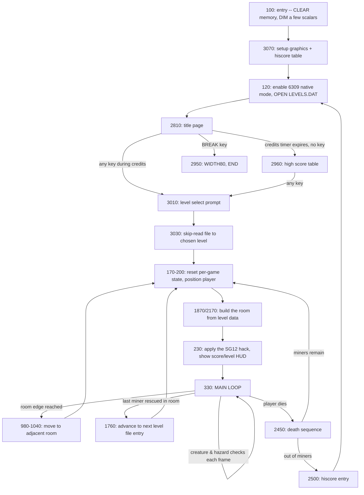

# HERO v1.1 source analysis

A working reference for the port, built by close reading of
`extracted_11/detok_HERO-SRC.BAS` (Nick Marentes' original, 342 lines,
September 2024). The goal here is to make explicit everything the
original author simply held in his head -- what each variable is for,
what each subroutine does, and how the pieces fit together -- so the
port can be a translation of *understood* logic, not a line-by-line
transcription of symbols whose meaning nobody wrote down.

Where the code is genuinely ambiguous (a few places are), that's
flagged explicitly rather than papered over with a confident-sounding
guess. Original line numbers are given throughout so anything here can
be checked directly against the source.

## 1. Control flow, top to bottom

## 2. Named subroutines and blocks

Classic BASIC has no real functions -- just line numbers, `GOTO`, and
`GOSUB`. The names below are ours, chosen to describe what each block
actually does; the original has none. Line ranges are inclusive.

### `setup_graphics_and_hiscores` (3070-3460, `GOSUB3070`)
Runs once, at program start, before anything else. Detects CoCo 3
(`PEEK(&HFFFE)*256+PEEK(&HFFFF)=35867`, a ROM signature check) to
enable RGB/wide-text mode if available. Reads the 6309-activation
machine code from `DATA` statements and POKEs it into memory just
below where BASIC's own variable space starts (`&H7FB0`-`&H7FE2`).
Initializes the (empty) hiscore string. Loads the sprite sheet
(`LOADM"GRAPHICS.GFX"`) and slices it into ~50 named image arrays via
`GET`. This is the block most directly relevant to the port's own
graphics-loading work -- see `hero-port/tests/sprite_copy_graphics_test.bas`.

### `title_page` (2810-3040, `GOSUB2810`)
Covers three visually distinct screens that share one control flow:
the "HOVERJET EMERGENCY RESCUE OPERATION" title/credits (2810-2950),
the high score table (2960-3010), and the level-select prompt
(3010-3040). `A` doubles as a one-shot flag here (2900-2910): after
the very first time through, it suppresses re-showing the credits text
and jumps straight to the hiscore table. The level-select step
(3010-3040) then does something worth noting for the port: to jump to
level `LV`, it re-reads the file from the beginning, discarding every
line until it's skipped past `LV-1` complete levels (`RIGHT$(A$,1)="."`
marks a level boundary in the file) -- there is no random access into
`LEVELS.DAT`, only sequential skip-ahead.

### `build_room_light_on` / `build_room_light_off` (1870-2160, 2170-2380, `GOSUB1870` / `GOSUB2170`)
Two near-identical routines that walk one room's worth of level data
(50 characters, `A=1 TO 50`) and place a 16x24 tile for each one. The
*only* difference between them is which sprite gets drawn for a
walkable floor tile (`B`, lit, vs `G`, unlit) -- see the level-encoding
table below for what every character means. Also responsible for
noticing and recording *where* certain special tiles are (the light
switch, spider, snake, bat, raft, moving wall, laser wall) into the
scalar variables the main loop later reads every frame. This
duplication (two whole copies of the same 50-iteration loop, differing
in one sprite choice) is a strong candidate for collapsing into one
routine with a parameter in the port.

### `main_loop` (330-1680)
The heart of the game, one iteration per frame (`FOR NN=0 TO 1 STEP 0`
-- an infinite loop written as a degenerate `FOR`, a common trick in
BASICs without a native `DO`). Structure, in the order things actually
happen each frame:
- **330-340**: compute `U` (the current screen-memory collision
  offset for the player's position -- see the collision section
  below), read the keyboard, and check for an extra-life score
  threshold.
- **350-930**: player movement and animation. This is the single most
  tangled section in the whole program -- walking, flying (jetpack),
  falling, and standing are all interleaved through shared `GOTO`
  targets (`420` walk-left, `500` walk-right, `610` fly-left, `680`
  fly-right, `750`/`800` fly-up/down, `890` stand), because they all
  need to share the same collision-checking code rather than
  duplicate it. `O` (an animation-frame index 1-4) and `PD` (facing
  direction) together select which of the pre-sliced walk-cycle
  sprites gets drawn.
- **980-1040**: room-edge detection -- reaching the left/right screen
  edge triggers a transition to the adjacent room (if the level data
  says one exists at that edge), otherwise the player is blocked.
- **1070-1680**: one hazard/creature check per frame, unconditionally,
  in this fixed order: laser-wall carryover (1070), spider (1100-1130),
  moving wall (1150-1240), snake (1260-1360), bat (1380-1420), raft
  (1450-1500), bomb (1520-1630), laser (1650-1680). Each follows the
  same shape: if the hazard isn't present in this room, skip; else
  animate it one step, then check for a collision with the player.

### `player_dead` (2450-2490, target of many collision checks via `GOTO2450`)
Flash the player sprite red/normal a few times, play a death jingle,
decrement `MN` (miners/lives remaining). If lives remain, respawn at
the room's entry point (`GOTO200`). If not, fall into the hiscore
check.

### `hiscore_entry` (2500-2570)
If the score beats any of the 4 stored entries, prompt for a 9-character
name via `LINE INPUT`, format a fixed-width record, and splice it into
the hiscore string `H$` (19 characters per entry: 6-digit score + 2-digit
level + 2-digit room + 9-character name).

### `update_score_display` (2600-2730, `GOSUB2600`, alternate entry at `GOSUB2610`)
Draws a right-to-left digit string using the pre-sliced digit sprites
(`S0`-`S9`). Worth knowing for the port: this is called two different
ways -- `GOSUB2600` formats the live score (`R`) into decimal first;
`GOSUB2610` skips that step, for callers (level/room number display,
250) that have already built their own pre-formatted string. This
"jump into the middle of a shared subroutine to skip part of it" is a
classic BASIC idiom with no direct modern equivalent -- the port should
just make the formatting step an explicit, separate call.

### `draw_men_display` / `draw_bombs_display` (2760-2790, `GOSUB2760` / `GOSUB2780`)
Redraw the row of small icons showing remaining lives/bombs. Each
clears its row first, then draws one icon character per remaining
life/bomb by POKEing directly into text-mode-like screen positions
(`&H1881`, `&H1897`, etc.) rather than using `PUT` -- these are small
enough (a single repeated character) that direct POKE was presumably
faster than a sprite blit. (Note: **this exact POKE-based technique
doesn't port directly**, since `POKE` itself is unreliable on this
target -- see `hero-port/upstream-reports/ugbasic-poke-broken.md`. Our
`fillrow`/`writerow` procedures are the port's equivalent mechanism.)

### `bomb_explosion_effect` (2390-2420, `GOSUB2390`)
A few frames of screen-flash (POKEing the PIA/SAM registers directly,
similar to the SG12 hack itself) plus a short descending musical
sting, timed to a bomb detonating.

## 3. Variable dictionary

### Player state (persists across the whole game)
| Name | Purpose |
|---|---|
| `PX`, `PY` | Player position, in pixels, top-left of the player sprite |
| `PD` | Facing direction: `0` = left, `1` = right |
| `O` | Walk-cycle animation frame, `1`-`4` |
| `HV` | "Hover" flag -- whether the jetpack is actively thrusting upward |
| `N` | Mid-jetpack-transition flag (mid-flight-turn animation state) |
| `F` | Frame counter tracking airborne time (increments during both flying and falling, plus a +4 penalty specifically near the laser hazard at 1710) -- fuel consumption is measured against this, not against jetpack-thrust time alone |
| `Z` | Overloaded three separate ways, confirmed by checking every occurrence: raft-contact flag in the main loop (200, 890, 1460 -- suppresses the normal standing-pose redraw while riding the raft); a throwaway `INSTR` scratch result when clearing a laser-destroyed wall marker from the level string (1590, 1670); and, completely unrelated to either, the "how many levels have I skipped past so far" counter during the level-select skip-ahead read (2820, 3030) |
| `MN` | Miners (lives) remaining |
| `BM` | Bombs remaining |
| `R` | Score |
| `I` | Score threshold for next extra life (increments by 7000 each time) |

**The `PA`/`SX` fuel gauge, traced precisely rather than guessed** (worth
its own note -- this was wrong in an earlier pass of this document, and
the corrected trace revealed a nicer piece of game design than the
first, mistaken guess): `PA` is a screen-memory address pointer that
walks across a bar of pixels representing remaining jetpack fuel.
- **Filling** (280-300, only when `SX=1`, i.e. once per fresh level
  start): `PA` starts at `&H1782` and increments up to `&H179D`,
  POKEing alternating bright values as it goes -- drawing the gauge
  fully charged.
- **Draining during flight** (930-950): every 23 frames of jetpack use
  (`F` reaching that threshold), `PA` decrements by one and that
  position gets blanked -- the gauge visibly shrinks as fuel is spent.
  If `PA` decrements all the way back down to `&H1782` (gauge
  completely empty), the level *restarts from its first room*
  (`GOTO2450`, with `XP`/`YP`/`S`/`RM` all reset) rather than just a
  normal in-place respawn -- running out of fuel entirely is more
  punishing than an ordinary death.
- **Draining as a level-complete bonus** (1770-1790): when the last
  room of a level is cleared, whatever fuel remains drains in a short
  animated sequence, awarding 10 points per segment (`R=R+10`) until
  `PA` reaches `&H1782` again, then a short fanfare plays before moving
  on to the next level's data.

### Level/room navigation
| Name | Purpose |
|---|---|
| `L$(30)` | The current level's room data, one string per room, read from `LEVELS.DAT` |
| `S` | Index into `L$()` -- which room within the current level the player is in |
| `LV` | Current level number (1-20) |
| `RM` | Current room number within the level (for the HUD, not the same as `S`'s array indexing role) |
| `XP`, `YP` | Player's spawn position when (re)entering a room |
| `UD` | Scratch flag used only within the room-edge-transition logic (980-1020) to distinguish "just arrived, check the far edge too" from a fresh edge check |
| `SX` | One-shot flag: does the jetpack fuel gauge need filling for a freshly-(re)started level? See the dedicated note below the table -- this mechanic turned out more interesting than "flag" suggests |

### Collision detection
| Name | Purpose |
|---|---|
| `U` | Screen-memory byte offset corresponding to the player's current pixel position: `U = PY*32 + PX*.125` (32 bytes per row in the PMODE4/SG12 framebuffer, 8 pixels per byte). Every collision check reads bytes at `U` plus a fixed offset for "the pixel row/column N pixels away in some direction." |
| `A`, `B`, `D`, `E` | Overloaded almost everywhere: general-purpose temporaries holding a byte just read via `PEEK`, to be compared against known "solid" or "hazard" pixel values (see below) |

### Sprite/tile image arrays (populated once, via `GET`, in `setup_graphics_and_hiscores`)
All of these are `PUT`-only after setup -- they never change contents
during play, just get redrawn at different screen positions.

| Names | What they hold |
|---|---|
| `A`-`N` | The 14 distinct wall/terrain tile graphics, one per level-file letter `A`-`N` (see the level format table below) |
| `O`, `P` | Small icon sprites: light-off and light-on lantern, respectively (distinct from the *scalar* `O` used for player animation -- BASIC's array/scalar namespaces are separate, but visually this is exactly the kind of collision worth flattening in the port) |
| `Q`, `R`, `S`, `T` | The four "rescued miner" pose sprites (right-facing lit, right-facing unlit or similar variants -- exact pairing worth re-checking visually against the sprite sheet rather than assumed) |
| `V` | Lava tile |
| `W` | Raft tile |
| `L1`, `L2`, `L3` | Player walking-left sprite, 3-frame cycle |
| `R1`, `R2`, `R3` | Player walking-right sprite, 3-frame cycle |
| `HL`, `HR` | Player flying (hovering), facing left/right |
| `HI`, `HJ` | Player standing still, facing left/right |
| `MR`, `ML` | Moving-wall-mechanism end-cap sprites, right/left |
| `MM`, `NN` | Used in the moving-wall/room-transition bookkeeping (exact distinct roles from `M`/`N` worth re-verifying against usage before porting) |
| `SP` | Spider sprite |
| `N1`-`N6` | Snake sprite, 6-frame undulating cycle |
| `T1`, `T2` | Bat sprite, 2-frame wingbeat cycle |
| `S0`-`S9` | The ten digit sprites, for score/level/room display |
| `LZ` | A small scratch buffer used to save/restore the strip of screen behind a moving laser beam (`GET`/`PUT` round-trip, not a fixed drawing) |
| `G` | Also reused as the "erase to floor tile" sprite wherever a hazard/pickup needs to be cleared from the screen |
| `B` | Also reused as a small "explosion/impact" sprite in a few hazard-defeat sequences -- distinct from scalar `B`'s heavy use as a temporary elsewhere |

### Hazard/creature state (each `0`/absent unless the current room has one)
| Names | Purpose |
|---|---|
| `XS`, `YS` | Spider position |
| `XN`, `YN`, `JN` | Snake position and animation-frame counter |
| `XB`, `YB`, `BZ` | Bat position and animation-frame counter |
| `XW`, `YW`, `CW` | Moving-wall position and animation-frame counter (`CW` also doubles as "is a moving wall present in this room at all," `0` = no) |
| `RF`, `RD` | Raft position and direction of travel |
| `BX`, `BY`, `BT`, `BB`, `BC` | An active bomb's origin position, countdown timer, computed blast screen-address, and current blast-flash color |
| `LD`, `LC` | Laser wall's screen X-position and a hit-counter (needs `LC` hits before it can be destroyed) |
| `LS`, `MC` | Screen addresses of the light switch and a moving-wall control switch, respectively -- read directly via `PEEK` each frame to detect "has this been triggered" |

### Miscellaneous / setup-only
| Names | Purpose |
|---|---|
| `CC` | Set once at boot: is this actually a CoCo 3 (wide-text/RGB capable)? |
| `H$` | The hiscore table, one flat 76-character string, 19 characters per entry x 4 entries |
| `A$`, `B$` | Scratch strings used only during hiscore entry |
| `S$` | Scratch string used only for formatting a number into a digit string before `update_score_display` draws it |
| `PW` | Set once (`20`) and never read again anywhere in the source -- likely a leftover from an earlier revision. **Don't port this one at all.** |
| `V` (in `bomb_explosion_effect` only) | A local volume-fade counter for the explosion sound -- unrelated to the lava-tile array `V` above; different code region, no actual conflict, just another visually-confusing reuse |

## 4. Level file (`LEVELS.DAT`) format

Confirmed from the character-to-tile mapping in `build_room_light_on`
(1900) and the explicit comment at line 1860:

> `P=LIGHT Q=MINER-RT R=MINER-LF S=SPIDER T=SNAKE U=BAT I=WALLS V=LAVA`

Each room is one 50-character text line (plus the file's own line
terminator). Characters map to tiles as follows (all offsets computed
as `ASC(char) - 64`, so `A`=1 up to `X`=24):

| Char | Meaning |
|---|---|
| `A`-`H` | Eight distinct wall/terrain tile graphics |
| `I` | A moving-wall segment start (records position, sets `CW=1`, then falls through to draw as if `G`) |
| `J`, `M`, `N` | Blank/no tile -- just advances the column, draws nothing |
| `K`, `L` | Wall segments that can be destroyed by the laser (tracked via `INSTR`/`MID$` search for these specific letters elsewhere -- see `LD` above) |
| `O` (same target as `G`) | Open floor |
| `P` | Light switch |
| `Q` | A miner needing rescue, right-facing |
| `R` | A miner needing rescue, left-facing |
| `S` | Spider spawn point |
| `T` | Snake spawn point |
| `U` | Bat spawn point |
| `V` | Lava |
| `W` | Raft spawn point |
| space (`ASC=32`) | End of this row -- reset column to 0, advance to the next 24-pixel row down, don't advance the room-data character pointer's "column" tracking the same way |

A trailing `.` on the room's *text line itself* (not a per-character
tile code -- this is about the line as a whole) marks the last room of
a level, used both by the initial "how many rooms until the next `.`"
scan (150) and the level-select skip-ahead (3030).

Rescued-miner tracking is clever and worth calling out: rather than a
separate array, the game **edits the level string in place** --
`MID$(L$(S),A,1) = MID$(L$(S),A+1,1)` (1120 and similar) overwrites a
defeated creature's letter with whatever character follows it in the
string, permanently removing that hazard from the room for the rest of
the session. This means `L$()` is not just "the level as loaded" --
it's mutated as play progresses, and a room's *current* state can only
be reconstructed by replaying every hazard-defeat that's happened
since it was first loaded. Worth deciding deliberately in the port
whether to keep this same in-place-mutation approach or track defeated
hazards in a separate structure.

## 5. Screen memory / collision detection scheme

The game never asks "is there a wall to my left" via any structured
concept of a wall -- it directly inspects the raw bytes of the visible
screen at a computed address, and treats specific *pixel byte values*
as meaning specific things:

- `U = PY*32 + PX*.125` -- convert the player's pixel position into a
  byte offset into the 6144-byte PMODE4/SG12 framebuffer (32 bytes per
  scanline row, 8 pixels per byte -- exactly the layout this whole
  project's SG12 investigation is built on; see
  `hero-port/tests/sg12_hypothesis_test.bas` for the from-scratch
  confirmation that ugBASIC's `BITMAPADDRESS` uses this same real
  hardware layout).
- A fixed collection of offsets from `U` (things like `U+&H1040`,
  `U+&HE1F`, `U+&HDFF`) correspond to specific pixel positions relative
  to the player -- one scanline row below, one to the left, etc. --
  used to check "is the ground/wall/hazard there solid."
- Specific byte *values* read back mean specific things: `128` reads as
  "empty space," `239` as "instant death," `234` as another
  hazard/death case, `207` specifically as "raft" (checked directly at
  1460), and so on. **These exact values were never fully reverse-
  engineered this session** -- they're artifacts of exactly how the
  SG12-flipped semigraphics bytes for each specific tile graphic happen
  to encode, not a designed "meaning" -- porting this faithfully will
  need byte-for-byte comparison against the actual compiled sprite data
  once it's loaded through our own pipeline, not just copying the
  numbers from this source blind.

## 6. Known ambiguities -- flagged rather than guessed past

- **The priming read at 150** (reading lines into `L$()` before `S` is
  reset to `1` at 170) has an effect that isn't fully certain from
  reading the code alone -- possibly loading and discarding the file's
  first level as a warm-up, possibly something else. Worth confirming
  by tracing `LEVELS.DAT`'s actual byte layout directly before
  assuming either way.
- **Exact `Q`/`R`/`S`/`T` sprite identities** (labeled "the four
  rescued-miner poses" above) are inferred from their `GET` source
  coordinates being adjacent to the player's own walk sprites on the
  sheet, not from a comment confirming it -- worth a visual check
  against the actual rendered sprite sheet
  (`hero-port/tests/sprite_copy_graphics_test.bas` already renders the
  whole sheet) before relying on this in the port.
- **`MM`/`NN` vs the scalar `M`/`N`**: the source uses bare `M` and `N`
  as ordinary scratch temporaries in several places (770, 820, 1550
  area) that are unrelated to the `MM`/`NN` sprite arrays. Every usage
  of a single-letter variable in this source needs re-checking against
  its immediate context rather than assumed consistent across the
  whole file -- classic BASIC reuses names constantly, and this
  document's dictionary above groups things by inferred *role*, not by
  a guarantee that one name always means one thing everywhere it
  appears.
